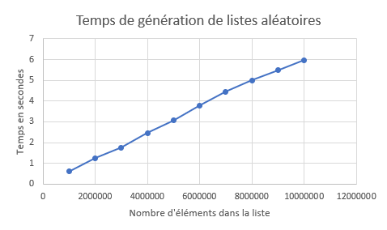
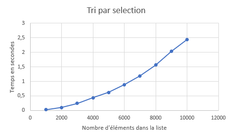
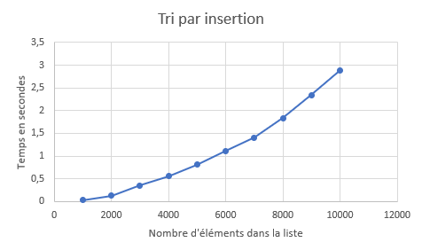
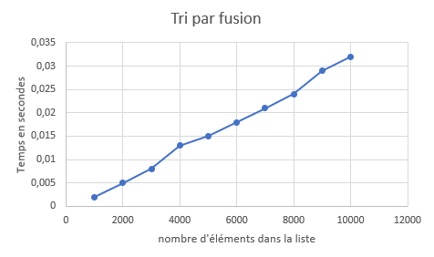
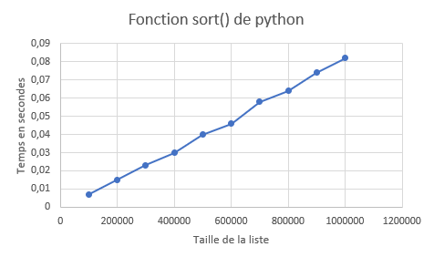

# TP : Faisons le tri

## Introduction

Le problème du tri est parmi les plus élémentaires en algorithmique, mais ses ramifications peuvent être poussées.

Le but de ce TP est d'implémenter différentes méthodes standard de tri et de comparer leur efficacité.

Nous aborderons par ce TP la notion de complexité algorithmique, c'est à dire l'évaluation de l'efficacité des algorithmes, indispensable pour les comparer entre eux.

### L'input

Nous travaillerons sur un tableau de nombres, par exemple :

```py
array: list[int] = [2, 34, -4, 2, 8, 1]
```

Notez que les entiers pourraient être remplacés par des nombres décimaux, des chaînes de caractère (à trier par ordre alphabétique) ou même des objets complexes (à trier selon une certaine clé de l'objet). Le fonctionnement est le même.

#### Comment générer un tableau de nombres aléatoires ?

Cela peut-être pratique pour générer de grands tableaux.

Voici comment générer un tableau de 10 nombres compris entre 0 et 100 :

```py
import random
array = [random.randint(0, 100) for i in range(10)]
```

#### Comment mesurer le temps écoulé ?

Cela sera indispensable pour évaluer nos algorithmes.

```py
import time
start: float = time.time()
# do something
end: float = time.time()
print("Temps écoulé :", end - start)
```

#### Exercice préliminaire : temps de génération d'un tableau

Complétez la fonction `generate_array_of_number` du fichier `sort/range.py` pour qu'elle génère un tableau de n nombres aléatoires entre 0 et 100.

Mesurez combien de temps prend python à générer un tableau composés de :

- 1 000 000 entrées
- 2 000 000 entrées
- 3 000 000 entrées
- ...
- 10 000 000 entrées

**Astuce** : vous pouvez écrire les nombres avec des underscores pour mieux les lire : `1_000_000`

Sur un tableur, générez un tableau permettant de visualiser le temps d'éxécution en fonction de la taille de l'entrée.



Comment vous semble évoluer la courbe ? Observez bien les différentes courbes du graphique ci-dessous. Quelle est la plus ressemblante à notre situation ? *Écrivez votre réponse ici*


La courbe semble évoluer comme la courbe O(n log n)

#### Quelques exemples de complexités courante :

- Un algorithme de complexité O(1) a un temps d'éxécution qui ne dépend pas de la taille de l'entrée. C'est très efficace.
- Un algorithme de complexité O(n) a un temps d'éxécution qui est proportionnel à la taille du problème à résoudre. Autrement dit, multiplier la taille de l'entrée par 10 multipliera le temps d'éxécution par 10. C'est une croissance linéaire. C'est plutôt efficace.
- Un algorithme de complexité O(n²) a un temps d'éxécution qui est proportionnel au carré de la taille du problème à résoudre. Autrement dit, multiplier la taille de l'entrée par 10 multipliera le temps d'éxécution par 100 ! Ce n'est pas terrible du tout...

## Les algorithmes

### 1. Tri par sélection

Observez attentivement l'animation de tri par sélection ci-dessous pour en comprendre le fonctionnement.


Écrivez en français classique ce que vous voyez. Quel est le fonctionnement ? Comment l'expliqueriez-vous à quelqu'un ? 

Le tri par sélection consiste à prendre la première valeur de la liste et de la comparer avec chaque autre valeur de la liste.
Si une valeur est plus petite que la première, alors on utilise cette valeur pour faire les comparaisons avec les valeurs restantes dans la liste, tout en sélectionnant à nouveau les valeurs plus petites si il y en a.
On échange les positions dans la liste de la plus petite valeur trouvée avec la première valeur que nous avons utilisé.
Puis on recommence la même procédure avec comme valeur de référence la valeur suivante à la référence précédente que nous avons pris.

Puis implémentez l'algorithme en python dans la fonction `sort` du fichier `sort/selection.py`. Vérifiez son bon fonctionnement en éxécutant le fichier `test.py`.

Mesurez le temps d'éxécution pour un tableau de :

- 1000 entrées
- 2000 entrées
- ...
- 10000 entrées

Tracez le graphique correspondant.



Quelle semble être la complexité de notre fonction de tri ? Cela est-il logique par rapport au code que vous avez implémenté ? *Écrivez votre réponse ici*

La complexité semble être O(N²), cela est logique car chaque élément du tableau est comparé avec les autres éléments du tableau.

### 2. Tri par insertion

Observez attentivement l'animation de tri par insertion ci-dessous pour en comprendre le fonctionnement.


Écrivez en français classique ce que vous voyez. Quel est le fonctionnement ? Comment l'expliqueriez-vous à quelqu'un ? 

On prend le 2eme élément de la liste et on le compare avec le précédent.
Si il est plus petit, on retire le 2eme élément et on le place avant le premier.

On passe à l'élément suivent, on le compare avec les éléments précédents jusqu'à arriver au début de la liste ou à un élément plus petit.
Si on est à la fin de la liste, on place l'élément en premier, sinon on le place après l'élément plus petit trouvé.

Puis implémentez l'algorithme en python dans la fonction `sort` du fichier `sort/insertion.py`. Vérifiez son bon fonctionnement en éxécutant le fichier `test.py`.

Mesurez le temps d'éxécution pour un tableau de :

- 1000 entrées
- 2000 entrées
- ...
- 10000 entrées

Tracez le graphique correspondant.



Quelle semble être la complexité de notre fonction de tri ? Cela est-il logique par rapport au code que vous avez implémenté ? *Écrivez votre réponse ici*

La complexité semble être O(N²), cela est logique car chaque élément du tableau est comparé avec les autres éléments du tableau (semblable au tri par selection)

### 3. Tri par fusion

Le tri par fusion est plus complexe : il utilise en effet la récursion, c'est à dire une fonction qui s'appelle elle-même.

Exemple :

```py
def loop_forever():
    loop_forever()
```

L'appel de cette fonction va entraîner une boucle infinie, car il n'y a pas de condition qui stoppe la boucle.

Voici une fonction récursive avec une "condition" pour la récursion.

```py
def increment_until_10(i):
    if i < 10:
        return increment_until_10(i + 1)
    else:
        return i
```

Si on appelle `increment_until_10(1)`, la fonction sera appelée 9 fois supplémentaires pour "compter" jusqu'à 10.

#### Exercice préliminaire : récursion

Complétez la fonction `sort` du fichier `sort/recursion.py` en suivant les instructions suivantes.

Utilisez le concept de la récursion pour calculer la factorielle du nombre passé en paramètre.

Pour rappel, la factorielle de 5 est 5 x 4 x 3 x 2 x 1 = 120.

Vérifiez son bon fonctionnement en éxécutant le fichier `test.py`.

#### Implémentation du tri par fusion

Observez bien le schéma suivant : il représente le concept du tri par fusion.


Cet algorithme est de type "diviser pour régner".

Écrivez en français classique ce que vous voyez. Quel est le fonctionnement ? Comment l'expliqueriez-vous à quelqu'un ?

Le tri par fusion consiste à séparer le tableau de valeurs en tableaux de valeurs plus petits, jusqu'à obtenir des tableaux avec une seule valeur.
Une fois qu'on a au minimum deux tableaux avec une valeur, on les rassemble en un tableau et en placant la valeur la plus petite en premier.
On obtient donc un tableau trié.
Puis on rassemble chaque tableau trié entre eux en comparant à chaque fois la plus petite valeur du tableau avec la plus petite de l'autre (qui se trouve forcément en première position).
Jusqu'à reconstituer un seul tableau, qui sera donc trié.

Complétez la fonction `sort` du fichier `sort/fusion.py` en suivant les instructions suivantes.

Il vous faudra deux fonctions :

- `sort`, la fonction principale, qui sera chargée de diviser les tableaux ayant plus d'un élément, et de rappeler `sort` avec ces nouveaux tableaux
- `merge`, la fonction qui sera appelée pour fusionner deux tableaux

Vérifiez son bon fonctionnement en éxécutant le fichier `test.py`.

Mesurez le temps d'éxécution pour un tableau de :

- 1000 entrées
- 2000 entrées
- ...
- 10000 entrées

Tracez le graphique correspondant.



Quelle semble être la complexité de notre fonction de tri ? Cela est-il logique par rapport au code que vous avez implémenté ? *Écrivez votre réponse ici*

La complexité semble être O(N log N), cela est logique car les opérations à réaliser son les mêmes indépendamment de la taille de la liste.

### 4. sort()

Bien que tout cela soit fascinant, Python possède sa propre méthode de tri : `sort()`.

Une dernière fois, analysez le temps d'exécution et découvrez si python fait mieux que nos implémentations rudimentaires ;)



J'ai augmenté la taille des tableaux aléatoires par rapport aux précédents algorithmes car le programme de test renvoyait souvent des temps d'exécution de 0 secondes avec des tailles entre 1000 et 10000.
La complexité semble être O(N), la courbe est semblable à celle de l'algorithme de tri par fusion, mais le temps d'exécution est bien plus rapide.

## Pour rendre ce TP

Merci de faire une Pull Request vers ce repository.

Le nom de la PR doit contenir votre nom et celui de votre collègue si vous êtes en binôme.

Vérifiez que votre code est conforme aux normes pep8 et aux autres critères de qualité dont nous avons parlé.

La PR doit également contenir un ou plusieurs graphiques présentant vos résultats sur la complexité des fonctions de tri.
