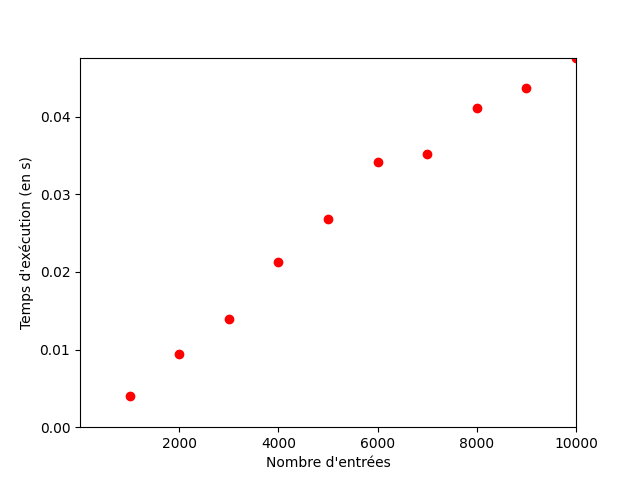

# TP : Faisons le tri

## Introduction

Le problème du tri est parmi les plus élémentaires en algorithmique, mais ses ramifications peuvent être poussées.

Le but de ce TP est d'implémenter différentes méthodes standard de tri et de comparer leur efficacité.

Nous aborderons par ce TP la notion de complexité algorithmique, c'est à dire l'évaluation de l'efficacité des algorithmes, indispensable pour les comparer entre eux.

### L'input

Nous travaillerons sur un tableau de nombres, par exemple :

```
array: list[int] = [2, 34, -4, 2, 8, 1]
```

Notez que les entiers pourraient être remplacés par des nombres décimaux, des chaînes de caractère (à trier par ordre alphabétique) ou même des objets complexes (à trier selon une certaine clé de l'objet). Le fonctionnement est le même.

#### Comment générer un tableau de nombres aléatoires ?

Cela peut-être pratique pour générer de grands tableaux.

Voici comment générer un tableau de 10 nombres compris entre 0 et 100 :

```py
import random
array = [random.randint(0, 100) for i in range(10)]
```

#### Comment mesurer le temps écoulé ?

Cela sera indispensable pour évaluer nos algorithmes.

```py
import time
start: float = time.time()
# do something
end: float = time.time()
print("Temps écoulé :", end - start)
```

#### Exercice préliminaire : temps de génération d'un tableau

Créez un fichier `range.py`.

Mesurez combien de temps prend python à générer un tableau composés de nombres allant de 0 à 100 et contenant :

- 1 000 000 entrées
- 2 000 000 entrées
- 3 000 000 entrées
- ...
- 10 000 000 entrées

**Astuce** : vous pouvez écrire les nombres avec des underscores pour mieux les lire : `1_000_000`

Sur un tableur, générez un tableau permettant de visualiser le temps d'éxécution en fonction de la taille de l'entrée.

Comment vous semble évoluer la courbe ?

- Elle évolue pratiquement de manière constante

Observez bien les différentes courbes du graphique ci-dessous. Quelle est la plus ressemblante à notre situation ?

-La courbe O(N) semble être la courbe la plus proche de notre situation


#### Quelques exemples de complexités courante :

- Un algorithme de complexité O(1) a un temps d'éxécution qui ne dépend pas de la taille de l'entrée. C'est très efficace.
- Un algorithme de complexité O(n) a un temps d'éxécution qui est proportionnel à la taille du problème à résoudre. Autrement dit, multiplier la taille de l'entrée par 10 multipliera le temps d'éxécution par 10. C'est une croissance linéaire. C'est plutôt efficace.
- Un algorithme de complexité O(n²) a un temps d'éxécution qui est proportionnel au carré de la taille du problème à résoudre. Autrement dit, multiplier la taille de l'entrée par 10 multipliera le temps d'éxécution par 100 ! Ce n'est pas terrible du tout...

## Les algorithmes

### 1. Tri par sélection

Créez un fichier `selection.py`.

Observez attentivement l'animation de tri par insertion ci-dessous pour en comprendre le fonctionnement.


Écrivez en français classique ce que vous voyez. Quel est le fonctionnement ? Comment l'expliqueriez-vous à quelqu'un ?

- Dans un tableau, 10 nombres sont présents, on les classes du plus petit au plus grand en parcours le tableau et en permutant chaque index par le plus petit

Puis implémentez l'algorithme en python. Vérifiez son bon fonctionnement avec différentes entreés.

Mesurez le temps d'éxécution pour un tableau de :

- 1000 entrées
- 2000 entrées
- ...
- 10000 entrées

Tracez le graphique correspondant.

Quel semble être la complexité de notre fonction de tri ? Cela est-il logique par rapport au code que vous avez implémenté ?

- La complexité semble être de O(N²), oui c'est logique car nous avons une boucle for dans une autre boucle for

### 2s. Tri par insertion

Créez un fichier `insertion.py`.

Observez attentivement l'animation de tri par insertion ci-dessous pour en comprendre le fonctionnement.


Écrivez en français classique ce que vous voyez. Quel est le fonctionnement ? Comment l'expliqueriez-vous à quelqu'un ?

- On prends le premier nombre de la liste et on le compare avec ceux d'avant. Si l'index est plus petit que le nombre d'avant, on les intervertis d'index puis on recompare le nombre avec son nouveau index avec celui d'avant jusqu'à ce qu'il soit plus grand ou au début du tableau.

Puis implémentez l'algorithme en python. Vérifiez son bon fonctionnement avec différentes entreés.

Mesurez le temps d'éxécution pour un tableau de :

- 1000 entrées
- 2000 entrées
- ...
- 10000 entrées

Tracez le graphique correspondant.

Quel semble être la complexité de notre fonction de tri ? Cela est-il logique par rapport au code que vous avez implémenté ?

- La compléxité semble être de O(N²). Cela paraît logique, mais elle pourrait peut-être être aussi égale à O(2^n) car il y a une boucle while dans une boucle for dans une boucle for

### 3. Tri par fusion

Le tri par fusion est plus complexe : il utilise en effet la récursion, c'est à dire une fonction qui s'appelle elle-même.

Exemple :

```py
def loop_forever():
    loop_forever()
```

L'appel de cette fonction va entraîner une boucle infinie, car il n'y a pas de condition qui stoppe la boucle.

Voici une fonction récursive avec une "condition" pour la récursion.

```py
def increment_until_10(i):
    if i < 10:
        return increment_until_10(i + 1)
    else:
        return i
```

Si on appelle `increment_until_10(1)`, la fonction sera appelée 9 fois supplémentaires pour "compter" jusqu'à 10.

#### Exercice préliminaire : récursion

Créez un fichier `recursion.py`.

Utiliser le concept de la récursion pour écrire une fonction `factorial` qui calcule la factorielle du nombre passé en paramètre.

Pour rappel, la factorielle de 5 est 5 x 4 x 3 x 2 x 1 = 120

Indice : la factorielle de 5 est donc égale à 5 multipliée par la factorielle de 4...

#### Implémentation du tri par fusion

Observez bien le schéma suivant : il représente le concept du tri par fusion.



Cet algorithme est de type "diviser pour régner".

Au début de la procédure, on divise le tableau en deux parties. Pour chaque tableau résultat, s'il est encore divisible, on continue, jusqu'à n'avoir que des "tableaux" à un élément.

À ce stade, la récursion a atteint sa "profondeur" maximale.

On va ensuite fusionner les tableaux uns à uns.

À chaque fois, on compare le premier élément de chaque tableau, et ajoute le plus petit des deux dans un nouveau tableau.

Par exemple, pour les tableaux [27, 38] et [3, 43] :

- on compare 27 et 3 : 3 est le plus petit, notre tableau est donc [3]
- on compare 27 et 43 : 27 est le plus petit, notre tableau est donc [3, 27]
- on compare 38 et 43 : 38 est le plus petit, notre tableau est donc [3, 27, 38]
- il reste 43, ce qui donne : [3, 27, 38, 43]

Creéz un fichier `fusion.py` et implémentez le tri par fusion.

Il vous faudra deux fonctions :

- `sort`, la fonction principale, qui sera chargée de diviser les tableaux ayant plus d'un élément, et de rappeler `sort` avec ces nouveaux tableaux
- `merge`, la fonction qui sera appelée pour fusionner deux tableaux

Mesurez le temps d'éxécution pour un tableau de :

- 1000 entrées
- 2000 entrées
- ...
- 10000 entrées

Tracez le graphique correspondant.

Quel semble être la complexité de notre fonction de tri ? Cela est-il logique par rapport au code que vous avez implémenté ?

- O(n log n), oui car on compare deux nombre lors du tri des deux tableaux

Question bonus : Y a-t-il des tailles de tableaux pour lesquelles le tri par fusion n'est pas aussi rapide que les précédents tris abordés ?

- Certainement au tableaux de petites tailles car le log devient de plus en plus constant au fur et à mesure du temps.

### 4. sort()

Bien que tout cela soit fascinant, Python possède sa propre méthode de tri : `sort()`.

Une dernière fois, analysez le temps d'exécution et découvrez si python fait mieux que nos implémentations rudimentaires ;)

## Pour rendre ce TP

Merci de faire une Pull Request vers ce repository.

Le nom de la PR doit contenir votre nom et celui de votre collègue si vous êtes en binôme.

Vérifiez que votre code est conforme aux normes pep8 et aux autres critères de qualité dont nous avons parlé.
