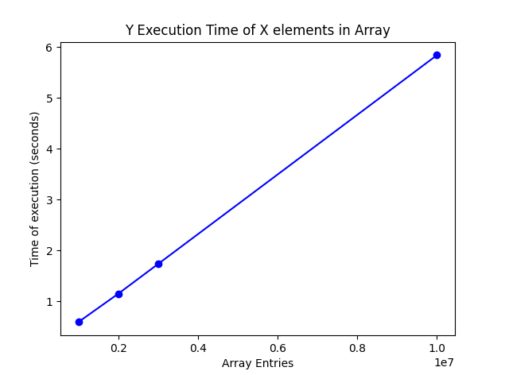
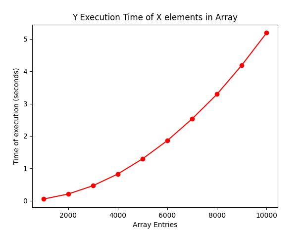
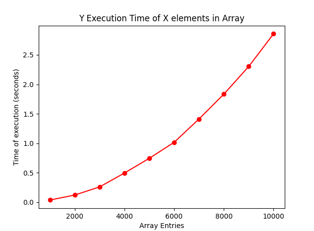
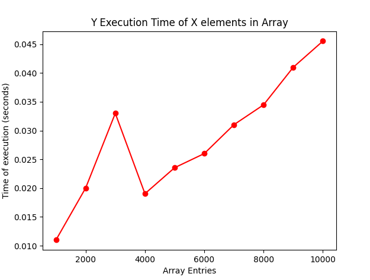

# TP : Faisons le tri

## Introduction

Le problème du tri est parmi les plus élémentaires en algorithmique, mais ses ramifications peuvent être poussées.

Le but de ce TP est d'implémenter différentes méthodes standard de tri et de comparer leur efficacité.

Nous aborderons par ce TP la notion de complexité algorithmique, c'est à dire l'évaluation de l'efficacité des algorithmes, indispensable pour les comparer entre eux.

### L'input

Nous travaillerons sur un tableau de nombres, par exemple :

```py
array: list[int] = [2, 34, -4, 2, 8, 1]
```

Notez que les entiers pourraient être remplacés par des nombres décimaux, des chaînes de caractère (à trier par ordre alphabétique) ou même des objets complexes (à trier selon une certaine clé de l'objet). Le fonctionnement est le même.

#### Comment générer un tableau de nombres aléatoires ?

Cela peut-être pratique pour générer de grands tableaux.

Voici comment générer un tableau de 10 nombres compris entre 0 et 100 :

```py
import random
array = [random.randint(0, 100) for i in range(10)]
```

#### Comment mesurer le temps écoulé ?

Cela sera indispensable pour évaluer nos algorithmes.

```py
import time
start: float = time.time()
# do something
end: float = time.time()
print("Temps écoulé :", end - start)
```

#### Exercice préliminaire : temps de génération d'un tableau

Complétez la fonction `generate_array_of_number` du fichier `sort/range.py` pour qu'elle génère un tableau de n nombres aléatoires entre 0 et 100.

Mesurez combien de temps prend python à générer un tableau composés de :

- 1 000 000 entrées
= Temps écoulé : 0.5889501571655273
- 2 000 000 entrées
= Temps écoulé : 1.1459660530090332
- 3 000 000 entrées
= Temps écoulé : 1.7308893203735352
- ...
- 10 000 000 entrées
= Temps écoulé : 5.838363170623779



**Astuce** : vous pouvez écrire les nombres avec des underscores pour mieux les lire : `1_000_000`

Sur un tableur, générez un tableau permettant de visualiser le temps d'éxécution en fonction de la taille de l'entrée.

Comment vous semble évoluer la courbe ? Observez bien les différentes courbes du graphique ci-dessous. Quelle est la plus ressemblante à notre situation ?

==> Un algorithme de complexité O(n)


#### Quelques exemples de complexités courante :

- Un algorithme de complexité O(1) a un temps d'éxécution qui ne dépend pas de la taille de l'entrée. C'est très efficace.
- Un algorithme de complexité O(n) a un temps d'éxécution qui est proportionnel à la taille du problème à résoudre. Autrement dit, multiplier la taille de l'entrée par 10 multipliera le temps d'éxécution par 10. C'est une croissance linéaire. C'est plutôt efficace.
- Un algorithme de complexité O(n²) a un temps d'éxécution qui est proportionnel au carré de la taille du problème à résoudre. Autrement dit, multiplier la taille de l'entrée par 10 multipliera le temps d'éxécution par 100 ! Ce n'est pas terrible du tout...

## Les algorithmes

### 1. Tri par sélection

Observez attentivement l'animation de tri par sélection ci-dessous pour en comprendre le fonctionnement.


Écrivez en français classique ce que vous voyez. Quel est le fonctionnement ? Comment l'expliqueriez-vous à quelqu'un ?

On a deux valeurs qui se comparent entre elles dans le tableau. Les deux le parcourent progressivement, une case à la fois. Quand la première valeur (en bleu) est plus grande que la seconde (en rouge) on stoppe la progression de la valeur rouge. Elle reprend et saute à la position derrière la valeur bleue dès que cette dernière devient plus petite. Quand la première valeur (en bleu) atteint la fin du tableau, on inverse la deuxième valeur en rouge avec la dernière valeur triée. On répète ce processus jusqu'à la fin du tableau.

Puis implémentez l'algorithme en python dans la fonction `sort` du fichier `sort/selection.py`. Vérifiez son bon fonctionnement en éxécutant le fichier `python3 -m unittest`. Le test correspondant au tri par sélection doit passer.

Mesurez le temps d'éxécution pour un tableau de :

Temps écoulé : 0.04999995231628418
Temps écoulé : 0.2057938575744629
Temps écoulé : 0.46288228034973145
Temps écoulé : 0.8257730007171631
Temps écoulé : 1.2953431606292725
Temps écoulé : 1.8596084117889404
Temps écoulé : 2.533503532409668
Temps écoulé : 3.2937428951263428
Temps écoulé : 4.1926844120025635
Temps écoulé : 5.192129850387573

Tracez le graphique correspondant.



Quelle semble être la complexité de notre fonction de tri ? Cela est-il logique par rapport au code que vous avez implémenté ?

==> complexité O(n²), la durée du processus (et la complexité) est décuplée du fait de la boucle imbriquée

### 2. Tri par insertion

Observez attentivement l'animation de tri par insertion ci-dessous pour en comprendre le fonctionnement.


Écrivez en français classique ce que vous voyez. Quel est le fonctionnement ? Comment l'expliqueriez-vous à quelqu'un ?

Dans un tableau à entiers mélangés, on va progressivement le parcourir en placant chaque entier plus ou moins en arrière ou pas en fonction de sa grandeur par rapport aux précédents entiers parcourus. On commence à l'index 1 et on continue jusqu'à la fin du tableau. On compare le dernier élément de la portion déjà triée/parcourue avec le suivant, si le suivant est plus petit, on va le placer dans la bonne position dans la portion déjà parcourue.

Puis implémentez l'algorithme en python dans la fonction `sort` du fichier `sort/insertion.py`. Utilisez les tests automatiques pour vérifier votre implémentation.

Mesurez le temps d'éxécution pour un tableau de :

- 1000 entrées
- 2000 entrées
- ...
- 10000 entrées
Temps écoulé : 0.037030696868896484
Temps écoulé : 0.1215670108795166
Temps écoulé : 0.2595536708831787
Temps écoulé : 0.4952089786529541
Temps écoulé : 0.7450480461120605
Temps écoulé : 1.0163190364837646
Temps écoulé : 1.4117050170898438
Temps écoulé : 1.8339478969573975
Temps écoulé : 2.30259108543396
Temps écoulé : 2.8572349548339844

Tracez le graphique correspondant.



Quelle semble être la complexité de notre fonction de tri ? Cela est-il logique par rapport au code que vous avez implémenté ?

==> complexité O(n²), la durée du processus (et la complexité) est décuplée du fait de la boucle imbriquée

### 3. Tri par fusion

Le tri par fusion est plus complexe : il utilise en effet la récursion, c'est à dire une fonction qui s'appelle elle-même.

Exemple :

```py
def loop_forever():
    loop_forever()
```

L'appel de cette fonction va entraîner une boucle infinie, car il n'y a pas de condition qui stoppe la boucle.

Voici une fonction récursive avec une "condition" pour la récursion.

```py
def increment_until_10(i):
    if i < 10:
        return increment_until_10(i + 1)
    else:
        return i
```

Si on appelle `increment_until_10(1)`, la fonction sera appelée 9 fois supplémentaires pour "compter" jusqu'à 10.

#### Exercice préliminaire : récursion

Complétez la fonction `sort` du fichier `sort/recursion.py` en suivant les instructions suivantes.

Utilisez le concept de la récursion pour calculer la factorielle du nombre passé en paramètre.

Pour rappel, la factorielle de 5 est 5 x 4 x 3 x 2 x 1 = 120.

Utilisez les tests automatiques pour vérifier votre implémentation.

#### Implémentation du tri par fusion

Observez bien le schéma suivant : il représente le concept du tri par fusion.


Cet algorithme est de type "diviser pour régner".

Écrivez en français classique ce que vous voyez. Quel est le fonctionnement ? Comment l'expliqueriez-vous à quelqu'un ?

Dans un tableau à entiers mélangés, on va le diviser par deux plusieurs fois de manière à avoir plusieurs groupes jusqu'à ce qu'il ne reste que plusieurs petits morceaux de 1 entier. On va ensuite prendre par groupe de deux chaque petit morceau et trier, puis regrouper les groupes de deux en quatre, et re-trier, puis regrouper en huit, et ainsi de suite. À la fin, on se retrouve avec le tableau d'origine reconstitué et trié.

Complétez la fonction `sort` du fichier `sort/fusion.py` en suivant les instructions suivantes.

Il vous faudra deux fonctions :

- `sort`, la fonction principale, qui sera chargée de diviser les tableaux ayant plus d'un élément, et de rappeler `sort` avec ces nouveaux tableaux
- `merge`, la fonction qui sera appelée pour fusionner deux tableaux

Utilisez les tests automatiques pour vérifier votre implémentation.

Mesurez le temps d'éxécution pour un tableau de :

- 1000 entrées
- 2000 entrées
- ...
- 10000 entrées

Temps écoulé : 0.010993719100952148
Temps écoulé : 0.020018577575683594
Temps écoulé : 0.032997846603393555
Temps écoulé : 0.019037485122680664
Temps écoulé : 0.023550033569335938
Temps écoulé : 0.02600574493408203
Temps écoulé : 0.031022071838378906
Temps écoulé : 0.03447532653808594
Temps écoulé : 0.04099726676940918
Temps écoulé : 0.0455470085144043

Tracez le graphique correspondant.



Quelle semble être la complexité de notre fonction de tri ? Cela est-il logique par rapport au code que vous avez implémenté ?

==> complexité O(n*log n)

Question bonus : Y a-t-il des tailles de tableaux pour lesquelles le tri par fusion n'est pas aussi rapide que les précédents tris abordés ?

### 4. sort()

Bien que tout cela soit fascinant, Python possède sa propre méthode de tri : `sort()`.

Une dernière fois, analysez le temps d'exécution et découvrez si python fait mieux que nos implémentations rudimentaires ;)

Temps écoulé : 0.0010001659393310547
Temps écoulé : 0.001971006393432617
Temps écoulé : 0.0030002593994140625
Temps écoulé : 0.0030336380004882812
Temps écoulé : 0.003978252410888672
Temps écoulé : 0.0049991607666015625
Temps écoulé : 0.00602269172668457
Temps écoulé : 0.005975008010864258
Temps écoulé : 0.007005453109741211
Temps écoulé : 0.007962942123413086

La durée du processus est en effet inférieure à 0.01 seconde dans la plupart des cas.

## Pour rendre ce TP

Merci de faire une Pull Request vers ce repository.

Le nom de la PR doit contenir votre nom.

Vérifiez que votre code est conforme aux normes pep8 et aux autres critères de qualité dont nous avons parlé.

La PR doit également contenir un ou plusieurs graphiques présentant vos résultats sur la complexité des fonctions de tri.
