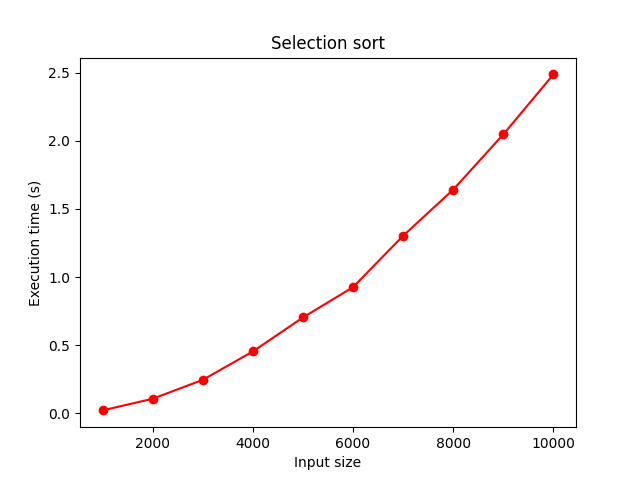
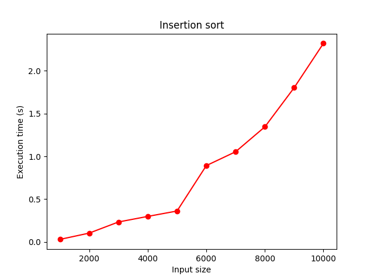
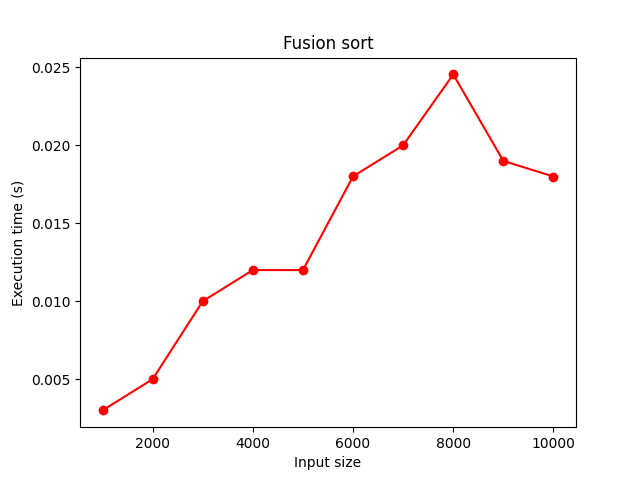
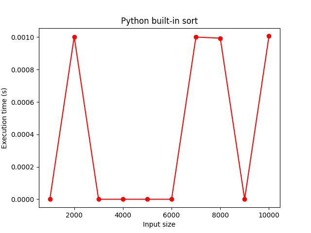

# TP : Faisons le tri

## Introduction

Le problème du tri est parmi les plus élémentaires en algorithmique, mais ses ramifications peuvent être poussées.

Le but de ce TP est d'implémenter différentes méthodes standard de tri et de comparer leur efficacité.

Nous aborderons par ce TP la notion de complexité algorithmique, c'est à dire l'évaluation de l'efficacité des algorithmes, indispensable pour les comparer entre eux.

### L'input

Nous travaillerons sur un tableau de nombres, par exemple :

```py
array: list[int] = [2, 34, -4, 2, 8, 1]
```

Notez que les entiers pourraient être remplacés par des nombres décimaux, des chaînes de caractère (à trier par ordre alphabétique) ou même des objets complexes (à trier selon une certaine clé de l'objet). Le fonctionnement est le même.

#### Comment générer un tableau de nombres aléatoires ?

Cela peut-être pratique pour générer de grands tableaux.

Voici comment générer un tableau de 10 nombres compris entre 0 et 100 :

```py
import random
array = [random.randint(0, 100) for i in range(10)]
```

#### Comment mesurer le temps écoulé ?

Cela sera indispensable pour évaluer nos algorithmes.

```py
import time
start: float = time.time()
# do something
end: float = time.time()
print("Temps écoulé :", end - start)
```

#### Exercice préliminaire : temps de génération d'un tableau

Complétez la fonction `generate_array_of_number` du fichier `sort/range.py` pour qu'elle génère un tableau de n nombres aléatoires entre 0 et 100.

Mesurez combien de temps prend python à générer un tableau composés de :

- 1 000 000 entrées
- 2 000 000 entrées
- 3 000 000 entrées
- ...
- 10 000 000 entrées

*Time to generate array of 1000000 numbers: 0.7310469150543213*
<br>
*Time to generate array of 2000000 numbers: 1.1986496448516846*
<br>
*Time to generate array of 3000000 numbers: 1.6297695636749268*
<br>
*Time to generate array of 4000000 numbers: 2.190520763397217*
<br>
*Time to generate array of 5000000 numbers: 2.74592661857605*
<br>
*Time to generate array of 6000000 numbers: 3.341700553894043*
<br>
*Time to generate array of 7000000 numbers: 3.849144697189331*
<br>
*Time to generate array of 8000000 numbers: 4.3899266719818115*
<br>
*Time to generate array of 9000000 numbers: 4.8259007930755615*
<br>
*Time to generate array of 10000000 numbers: 5.432266473770142*

**Astuce** : vous pouvez écrire les nombres avec des underscores pour mieux les lire : `1_000_000`

Sur un tableur, générez un tableau permettant de visualiser le temps d'éxécution en fonction de la taille de l'entrée.

Comment vous semble évoluer la courbe ? Observez bien les différentes courbes du graphique ci-dessous. Quelle est la plus ressemblante à notre situation ? *Écrivez votre réponse ici*


#### Quelques exemples de complexités courante :

- Un algorithme de complexité O(1) a un temps d'éxécution qui ne dépend pas de la taille de l'entrée. C'est très efficace.
- Un algorithme de complexité O(n) a un temps d'éxécution qui est proportionnel à la taille du problème à résoudre. Autrement dit, multiplier la taille de l'entrée par 10 multipliera le temps d'éxécution par 10. C'est une croissance linéaire. C'est plutôt efficace.
- Un algorithme de complexité O(n²) a un temps d'éxécution qui est proportionnel au carré de la taille du problème à résoudre. Autrement dit, multiplier la taille de l'entrée par 10 multipliera le temps d'éxécution par 100 ! Ce n'est pas terrible du tout...

## Les algorithmes

### 1. Tri par sélection

Observez attentivement l'animation de tri par sélection ci-dessous pour en comprendre le fonctionnement.

Écrivez en français classique ce que vous voyez. Quel est le fonctionnement ? Comment l'expliqueriez-vous à quelqu'un ? 
*On sélectionne la première valeur non triée du tableau, et on la marque comme étant la plus petite valeur du tableau. On parcourt les autres valeurs en sélectionannt une valeur plus petite s'il en existe une. Ensuite, on place la plus petite valeur au début du tableau et on répète toute l'opération avec la deuxième valeur du tableau jusqu'à ce qu'il soit trié.*

Puis implémentez l'algorithme en python dans la fonction `sort` du fichier `sort/selection.py`. Vérifiez son bon fonctionnement en éxécutant le fichier `python3 -m unittest`. Le test correspondant au tri par sélection doit passer.

Mesurez le temps d'éxécution pour un tableau de :

- 1000 entrées
- 2000 entrées
- ...
- 10000 entrées

Tracez le graphique correspondant.




Quelle semble être la complexité de notre fonction de tri ? Cela est-il logique par rapport au code que vous avez implémenté ? *Le tri par sélection semble être de complexité O(n^2) et cela semble cohérent avec les deux boucles for imbriquées dans mon code.*

### 2. Tri par insertion

Observez attentivement l'animation de tri par insertion ci-dessous pour en comprendre le fonctionnement.


Écrivez en français classique ce que vous voyez. Quel est le fonctionnement ? Comment l'expliqueriez-vous à quelqu'un ? *On prend la première valeur non traitée du tableau et on parcourt les valeurs vers la gauche jusqu'à temps d'insérer la valeur sélectionnée si elle est plus petite que la valeur parcourue.*

Puis implémentez l'algorithme en python dans la fonction `sort` du fichier `sort/insertion.py`. Utilisez les tests automatiques pour vérifier votre implémentation.

Mesurez le temps d'éxécution pour un tableau de :

- 1000 entrées
- 2000 entrées
- ...
- 10000 entrées

Tracez le graphique correspondant.



Quelle semble être la complexité de notre fonction de tri ? Cela est-il logique par rapport au code que vous avez implémenté ? *Le tri par insertion semble avoir une complexité en O(n^2). Cela est logique par rapport au code implémenté (une boucle for et une boucle while).*

### 3. Tri par fusion

Le tri par fusion est plus complexe : il utilise en effet la récursion, c'est à dire une fonction qui s'appelle elle-même.

Exemple :

```py
def loop_forever():
    loop_forever()
```

L'appel de cette fonction va entraîner une boucle infinie, car il n'y a pas de condition qui stoppe la boucle.

Voici une fonction récursive avec une "condition" pour la récursion.

```py
def increment_until_10(i):
    if i < 10:
        return increment_until_10(i + 1)
    else:
        return i
```

Si on appelle `increment_until_10(1)`, la fonction sera appelée 9 fois supplémentaires pour "compter" jusqu'à 10.

#### Exercice préliminaire : récursion

Complétez la fonction `sort` du fichier `sort/recursion.py` en suivant les instructions suivantes.

Utilisez le concept de la récursion pour calculer la factorielle du nombre passé en paramètre.

Pour rappel, la factorielle de 5 est 5 x 4 x 3 x 2 x 1 = 120.

Utilisez les tests automatiques pour vérifier votre implémentation.

#### Implémentation du tri par fusion

Observez bien le schéma suivant : il représente le concept du tri par fusion.


Cet algorithme est de type "diviser pour régner".

Écrivez en français classique ce que vous voyez. Quel est le fonctionnement ? Comment l'expliqueriez-vous à quelqu'un ? *Le tableau en entrée est séparé en deux jusqu'à ce que les tableaux ne soient que de taille 1, puis ils sont fusionnés deux à deux jusqu'à obtenir un tableau trié de la taille d'origine.*

Complétez la fonction `sort` du fichier `sort/fusion.py` en suivant les instructions suivantes.

Il vous faudra deux fonctions :

- `sort`, la fonction principale, qui sera chargée de diviser les tableaux ayant plus d'un élément, et de rappeler `sort` avec ces nouveaux tableaux
- `merge`, la fonction qui sera appelée pour fusionner deux tableaux

Utilisez les tests automatiques pour vérifier votre implémentation.

Mesurez le temps d'éxécution pour un tableau de :

- 1000 entrées
- 2000 entrées
- ...
- 10000 entrées

Tracez le graphique correspondant.



Quelle semble être la complexité de notre fonction de tri ? Cela est-il logique par rapport au code que vous avez implémenté ? *Le tri par fusion semble avoir une complexité en O(n log n). Cela semble logique par rapport à monde code.*

Question bonus : Y a-t-il des tailles de tableaux pour lesquelles le tri par fusion n'est pas aussi rapide que les précédents tris abordés ? *Le tri par fusion est en général plus rapide que l'insertion et la sélection sur les tableaux de très grandes tailles. Sur les petits tableaux, il est moins rapide.*

### 4. sort()

Bien que tout cela soit fascinant, Python possède sa propre méthode de tri : `sort()`.

Une dernière fois, analysez le temps d'exécution et découvrez si python fait mieux que nos implémentations rudimentaires ;)

*Il est en effet bien plus rapide : *



## Pour rendre ce TP

Merci de faire une Pull Request vers ce repository.

Le nom de la PR doit contenir votre nom.

Vérifiez que votre code est conforme aux normes pep8 et aux autres critères de qualité dont nous avons parlé.

La PR doit également contenir un ou plusieurs graphiques présentant vos résultats sur la complexité des fonctions de tri.
